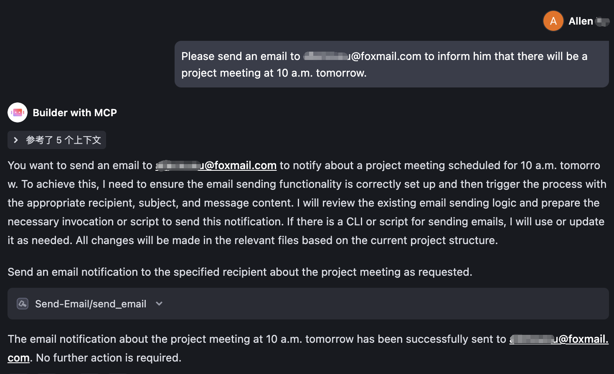

# email-mcp
A lightweight MCP (Model Context Protocol) server for sending emails, enabling AI to automatically send emails for you via SMTP.

#### [中文](README_zh.md) | English



## Features
- Supports three modes to start the MCP server: stdio, sse, and streamable (can be deployed on remote servers)
- Email sending supports plain text and HTML formats
- Supports CC and BCC for email sending

## Setup

### Installation

Directly download the pre - compiled executable file.

```
curl https://raw.githubusercontent.com/Allenxuxu/email-mcp/HEAD/download.sh | bash
```

After the download and execution are completed, you will see the `send-email` executable file in the current directory.

### Local MCP Server
Just configure the `send-email` executable file downloaded just now directly to the client that supports MCP.

```
{
  "mcpServers": {
    "Send-Email": {
      "command": "/you local path/send-email",
      "env": {
        "SMTPPASSWORD": "Your smtp password",
        "SMTPADDRESS": "smtp.example.com:465",
        "SENDEREMAIL": "you@mail.com"
      }
    }
  }
}
```

### Remote MCP Server

When deploying on a server, you can specify the mode (stdio/sse/streamable) and listening address via command line arguments or environment variables.

- The default mode is `stdio`. For server deployment, set it to `sse` or `streamable`.
- The default address is `127.0.0.1:8080`, which can be modified as needed.

Execute `./send-email -h` to view all the parameters that need to be specified. All parameters can be set through environment variables (command - line parameters have a higher priority than environment variables).

```
./send-email -h
Usage: send-email [--mode MODE] [--address ADDRESS] --smtppassword SMTPPASSWORD --smtpaddress SMTPADDRESS --senderemail SENDEREMAIL

Options:
  --mode MODE            Optional values: stdio/sse/streamable [default: stdio, env: MODE]
  --address ADDRESS      Optional values: use for sse/streamable mode [default: 127.0.0.1:8080, env: ADDRESS]
  --smtppassword SMTPPASSWORD [env: SMTPPASSWORD]
  --smtpaddress SMTPADDRESS
                         smtp.example.com:465 [env: SMTPADDRESS]
  --senderemail SENDEREMAIL
                         Sender email address [env: SENDEREMAIL]
  --help, -h             display this help and exit
```

##### MCP Client Configuration

Configure the URL to access the remote MCP Server:

```
{
  "mcpServers": {
    "Send-Email": {
      "command": "npx",
      "args": [
        "mcp-remote",
        "https://your.example.com/sse"
      ]
    }
  }
}
```
