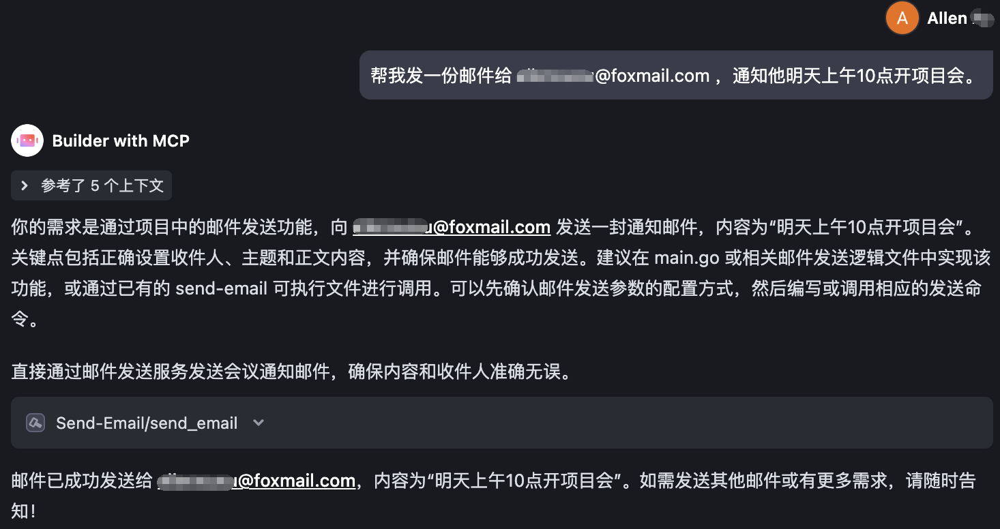

# email-mcp
一款轻量级的发送邮件 MCP 服务器，可让 AI 通过 SMTP 为您自动发邮件。 

#### 中文 | [English](README.md)



## Features
- 支持 stdio/sse/streamable 三种方式启动 MCP server（可部署在远程服务器）
- 邮件发送支持纯文本，HTML
- 邮件发送支持 CC 和 BCC 

## Setup 

### 安装

直接下载预编译好的可执行文件

```
curl https://raw.githubusercontent.com/Allenxuxu/email-mcp/HEAD/download.sh | bash
```

下载执行完成后，会在当前目录看到 `send-email` 可执行文件

### Local MCP Server
将刚刚下载的 `send-email` 可执行文件直接配置到支持 MCP 的客户端即可

```
{
  "mcpServers": {
    "Send-Email": {
      "command": "/需要修改成你的路径/send-email",
      "env": {
        "SMTPPASSWORD": "Your smtp password",
        "SMTPADDRESS": "smtp.example.com:465",
        "SENDEREMAIL": "you@mail.com"
      }
    }
  }
}
```

### Remote MCP Server

在服务器部署，可以通过命令行或者环境变量指定 mode(stdio/sse/streamable) 和监听地址 address.

mode 默认是 stdio， 服务器部署需要设置成 sse 或者 streamable

address 默认是 127.0.0.1:8080，可以按需修改

执行 `./send-email -h` 可查看所有需要指定的参数，所有参数均可以通过环境变量设置（命令行参数优先级高于环境变量）

```
./send-email -h
Usage: send-email [--mode MODE] [--address ADDRESS] --smtppassword SMTPPASSWORD --smtpaddress SMTPADDRESS --senderemail SENDEREMAIL

Options:
  --mode MODE            Optional values: stdio/sse/streamable [default: stdio, env: MODE]
  --address ADDRESS      Optional values: use for sse/streamable mode [default: 127.0.0.1:8080, env: ADDRESS]
  --smtppassword SMTPPASSWORD [env: SMTPPASSWORD]
  --smtpaddress SMTPADDRESS
                         smtp.example.com:465 [env: SMTPADDRESS]
  --senderemail SENDEREMAIL
                         Sender email address [env: SENDEREMAIL]
  --help, -h             display this help and exit
```

##### MCP 客户端配置

配置访问远端 MCP Server 的 URL

```
{
  "mcpServers": {
    "Send-Email": {
      "command": "npx",
      "args": [
        "mcp-remote",
        "https://your.example.com/sse"
      ]
    }
  }
}
```
